# ${\ {\color{cyan}C}}\{\color{red}R}\ 32.MIPS$

## Equipe:
- $\color{cyan}{Camila\ Vanessa\ de\ Matos\ Sousa}$
- $\color{red}{Antônio\ Rafael\ Oliveira\ da\ Cunha}$

Este projeto consiste em dois circuitos de 32 bits cada, baseados na arquitetura MIPS. Os circuitos foram carinhosamente apelidados de "Bicicleta" e "Moto", representando modelos monociclo e pipeline, respectivamente.

## Conceitos Rápidos:

- **Processador Monociclo:** 
    > Um processador monociclo é uma arquitetura de processador na qual cada instrução é executada em um único ciclo de clock. Isso significa que o processador passa por uma série de etapas fixas para executar uma instrução, e cada etapa ocorre em um ciclo de clock. As etapas típicas incluem busca de instrução, decodificação, execução e escrita de resultados. Embora seja simples de implementar e entender, o modelo monociclo pode ser menos eficiente em termos de utilização de recursos, pois o processador deve esperar o término de uma instrução antes de iniciar a próxima.

- **Processador Pipeline:** 
    > Um processador pipeline é uma arquitetura de processador que divide a execução de instruções em uma série de estágios sequenciais independentes. Cada estágio executa uma parte diferente do processamento da instrução, permitindo que várias instruções sejam executadas simultaneamente. Isso resulta em uma utilização mais eficiente dos recursos do processador e, geralmente, em um desempenho melhor em comparação com um processador monociclo. No entanto, o pipeline também introduz desafios, como a possibilidade de conflitos de dados ou dependências entre instruções, que precisam ser gerenciados adequadamente para garantir o correto funcionamento do processador.

## Funcionamento dos Circuitos:

### Circuitos internos:
Os seguintes circuitos são usados na versão Monociclo e Pipeline

 - Unidade de controle:
 
    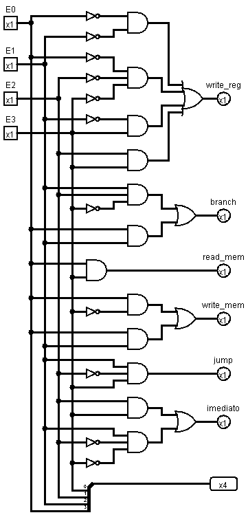

    A unidade de controle recebe 4 bits referente ao código da operação que será executada. Feita a análise combinacional pelo próprio Logisim referente aos bits de saída desejados em cada operação.

     * write_reg: Bit que vai permitir, ou não, que seja salvo um valor no registrador

     * branch: Bit que sinaliza que uma comparação será feito na ula e será usado para saber se "pula" ou não.

     * read_mem: Bit que permite que irá carregar algum valor da memória de dados.

     * write_mem: Bit que permite que irá salvar algum valor da memória de dados.

     * jump: Bit que faz com que ocorra um jump "imediatamente" 

     * imediato: Bit que sinaliza que será usado um imediato na ula

    * E os 4 bits no final, os mesmos 4 de entrada, passando novamente a informação de qual operação foi especificada na instrução, será usada na ULA.

 - Banco de registradores:
    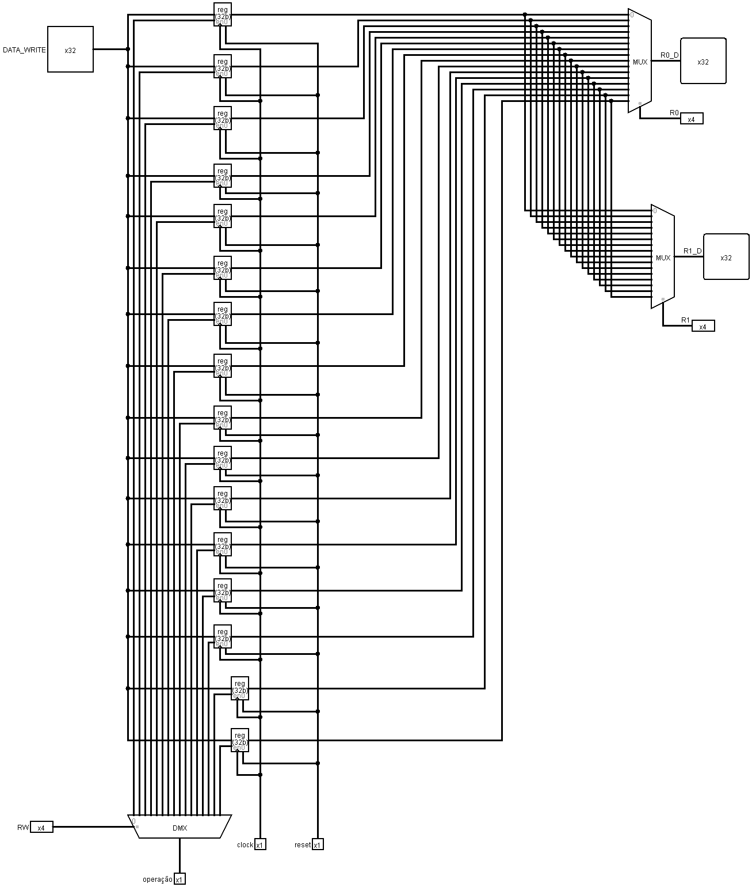

    O Banco de registradores com 16 registradores, com seus "códigos" de 0 a F, em hexadecimal. É possível especificar em qual registrador será salvo (RW) o valor que está chegando (DATA_WRITE), e/ou qual registrador eu quero saber o valor que estava guardado nele, podendo especificar pelo R0 ou R1 e suas saídas sendo respectivamente R0_D e R1_D.

    Na construção da instrução o RW seria o X (bits 24-27), R1 seria o Y (bits 20-23), R0 seria o Z (bits 16-19). Especificados suas posições nas instruções mais futuramente em "Configuração e Uso"

    Utilizando o bit (write_reg) que sai da unidade de controle para permitir, ou não, a sobrescrita de valores dentro de algum registrador especificado.

 - ULA:
    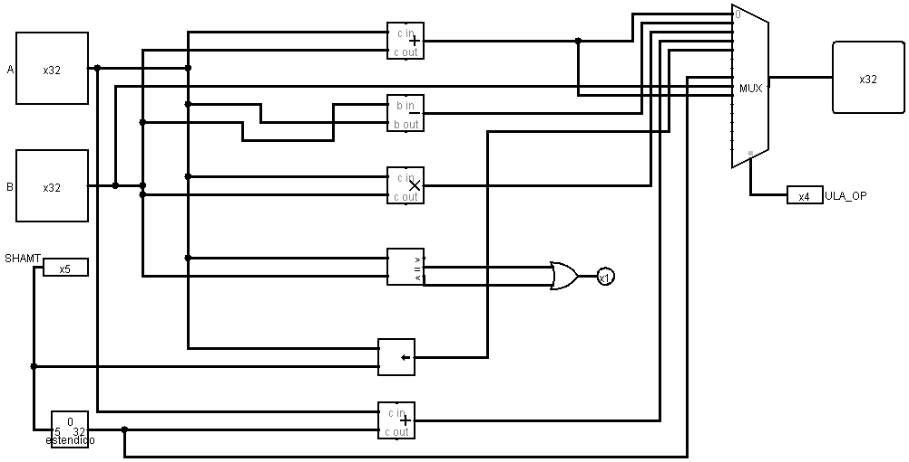

    A ULA é onde são feitas todas as operações mas a saída depende de qual operação foi especificada usando o ULA_OP como entrada no multiplexador para determinar essa saída. A ordem de disposição no multiplexador é a mesma ordem que pode ser vista na sessão "Configuração e Uso". 

- Memória de dados:
  
    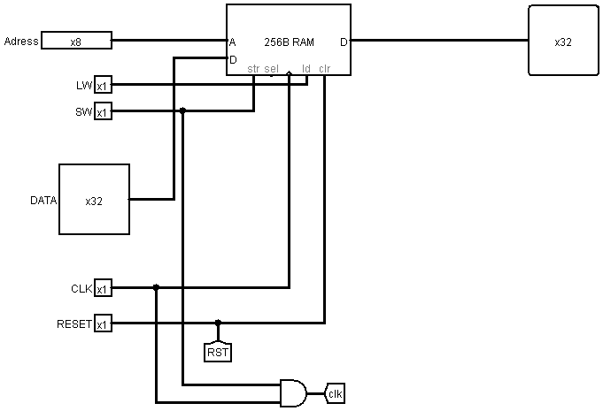

    A memória de dados irá salvar valores/dados em determinados endereços, da mesma forma irá carregar e por na saída um valor que estaria salvo em determinado endereço da memória.

    Os bits de entrada que são usados para permitir que possa salvar ou carregar da memória são respectivamente o SW e o LW, que saem da unidade de controle com os nomes: write_mem e read_mem, ambos se utilizam da entrada Adress que especifica a posição da memória mas somente para salvar na memória usa a entrada DATA que seria o valor que será salvo.

### Bicicleta (Modelo Moniciclo):
Para a versão do monociclo é basicamente a junção de todas os circuitos mostrados anteriormente adicionando um trecho antes do "PC" para dizer qual instrução vai entrar, se é a seguinte na contagem ou alguma especificada pelo jump ou bge.

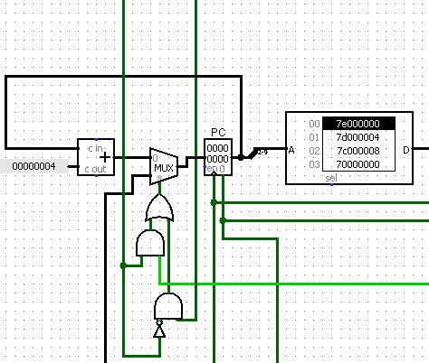

A visão geral do processador monociclo ficou da seguinte forma: 

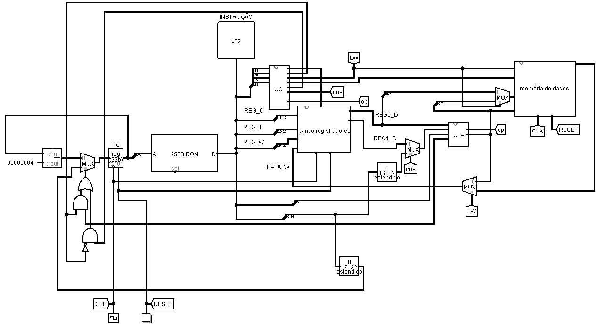

### Moto (Modelo Pipeline):
Para a versão Pipeline existem diversos registradores, ou a junção deles em um "pipeline", em que mais de uma instrução ocorre ao mesmo tempo, para garantir que as informações sejam salvas de cada etapa e "cheguem" nos tempos corretos em relação aos outros dados, mais a frente explicaremos as principais diferenças/adições em relação ao Monociclo.

Uma visão geral do processador Pipeline: 

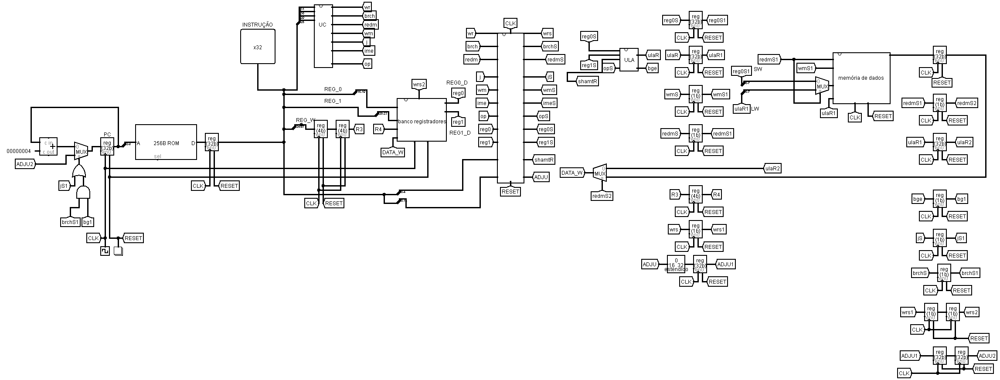

- Primeiro Registrador:

    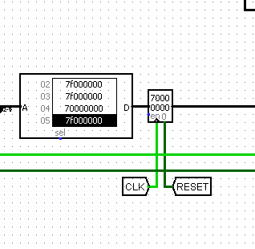
     
    Logo no começo do circuito Pipeline podemos notar as difereças entre o monociclo e ele, começamos com um registrador que guarda as 
    informações, ou seja guarda as as operações que está sendo pedida para ser realizada.

    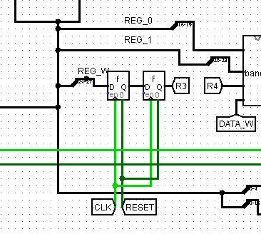
     
    Após guardar a operação e depois do pulso de clock é passado para o registrador que vai dizer qual vai ser o registrador que vai ser colocado o resultado ou o que a operação necessita no banco de registradores, mas antes passa por um distribuidor que vai pegar quatro bits para para ir para mais dois registradores para poder no tempo igual de clock das outras instruções

- Primeiro Pipeline
    Saindo do banco de registradores temos os registradores 1 e O e os bits que saem da unidade de controle também, todos eles também entram em registradores, dentro do primeiro pipeline, ode ele vai guardar dentro do registradores essas informações.
    
    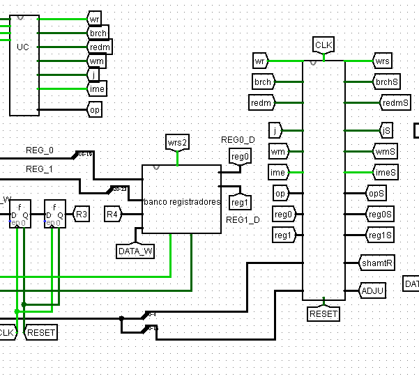
     
    
     
- Segundo Pipeline: 

    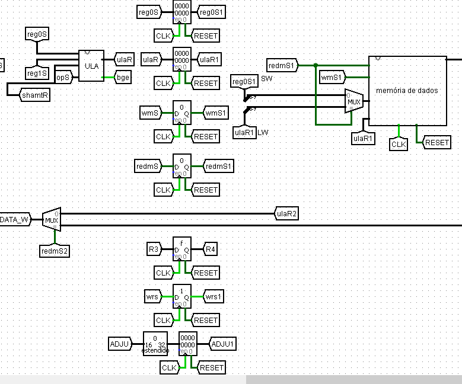
 
    No segundo pipeline temos agora os bits que saem da ula e mais alguns que saem do primeiro pipeline para que assim eles possam ficar o mesmmo tempo com as outras instruções, ouseja todas pasando pelo mesmo tempo de clock, e assim passando para a memória de dados.

- Terceiro Pipeline

     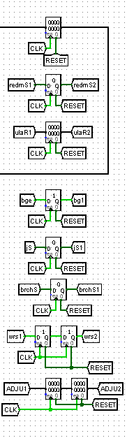
  
     Já no terceiro conjunto de registradores, primeiro guarda o resultado da memória de dados, o resultado da mais uma vez, os sinais tanto dos bges quanto dos jumps,e também o sinal da unidade de controle de escrever e ler a memória. E assim esses registradores que saem do terceiro pipeline são os que são usados logo no começo do circuito.
    
## Configuração e Uso:

As instruções devem ser configuradas em hexadecimal de acordo com o seguinte formato:

- $\color{blue}{0XYZ0000}$: **ADD** (Soma os valores dos registradores Y e Z e grava no registrador X)
- $\color{green}{1XYZ0000}$: **SUB** (Subtrai os valores dos registradores Y e Z e grava no registrador X)
- $\color{orange}{2XYZ0000}$: **MULL** (Multiplica os valores dos registradores Y e Z e grava no registrador X)
- $\color{purple}{3X0Z00SS}$: **ADDI** (Soma o valor do registrador Y com um imediato S (0 a 31) e grava no registrador X)
- $\color{teal}{5000AAAA}$: **JUMP** (Salta para a instrução especificada no endereço A)
- $\color{magenta}{60YZ00AA}$: **BGE** (Compara se o valor de Y é maior ou igual a Z e, se sim, salta para o endereço A)
- $\color{red}{7X0000SS}$: **LI** (Carrega o valor do imediato S no registrador X)
- $\color{brown}{80YZ0000}$: **SW** (Salva na memória o valor do registrador Y no endereço de memória do registrador Z)
- $\color{lime}{9XYZ0000}$: **LW** (Carrega da memória o valor no endereço Y+Z e salva no registrador X)

- $\color{gray}{7F000000}$: **Bolha** (O registrador F é usado como $zero$ e sempre contém o valor 0)

### Detalhes dos Parâmetros:
- $X$: $\color{Thistle}{Registrador\ de\ destino}$
- $Y$: $\color{Plum}{Registrador\ base\ para\ operações}$
- $Z$: $\color{Periwinkle}{Registrador\ base\ para\ operações}$
- $SS$: $\color{SeaGreen}{Valor\ do\ imediato\ (0\ a\ 31)}$
- $A$: $\color{SkyBlue}{Endereço\ da\ instrução}$

Certifique-se de seguir corretamente as configurações para garantir o funcionamento adequado do processador.

## Erro no Pipeline
Todas as funções e instruções foram testadas e estão funcionando corretamente e as informações estão chegando corretamente no tempo de clock previsto, mas foi detectado um erro quando aplicado para realizar o cálculo de duas matrizes 2x2 em que existem 3 loops e o somatório (addi) para o correto funcionamento de um deles não estava acontecendo. Era realizado o cálculo correto daquela posição na matriz resultante da mas devido a este erro no somatório não era possível calcular as outras posições da matriz. 

Dentro do circuito acompanhamos como essa instrução estava se comportando dentro do processador e no momento em que os dados estão entrando no banco de registradores o bit relativo ao salvamento de dados no registrador estão em 0, chegando atrasado em relação à esses dados, possivelmente afetado pelas instruções anteriores que não há salvamento de dados no banco de registradores.  
